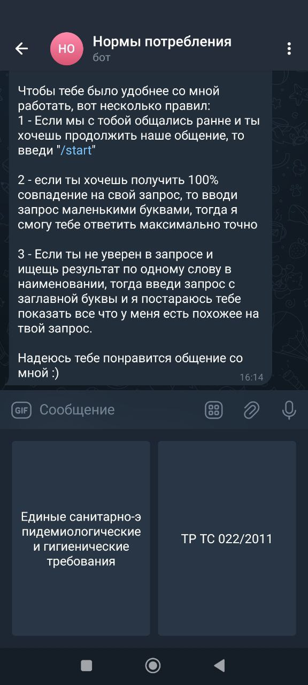
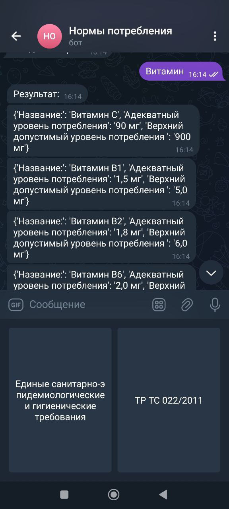

# Telegram-бот: нормы потребления витаминов и минералов

🔍 Этот бот помогает быстро находить нормы потребления витаминов и минералов по официальным документам:

— Единые санитарно-эпидемиологические и гигиенические требования (с изменениями на 14.11.2023) - **АУП2.xlsx**
— Технический регламент Таможенного союза (маркировка пищевой продукции) - **ТР ТС 022/2011.xlsx** 

---

## 🚀 Как запустить

1. Установите зависимости:
```bash
pip install -r requirements.txt
```

2. Замените `YOUR_BOT_TOKEN` в `bot.py` на токен вашего Telegram-бота.

3. Запустите:
```bash
python bot.py
```

---

## 🤖 Как пользоваться

1. Нажмите `/start`
2. Выберите нужный документ:
   - `Единые санитарно-эпидемиологические и гигиенические требования`
   - `ТР ТС 022/2011`
3. Введите запрос — например: `витамин с`, `цинк`, `магний`
4. Бот покажет норму и верхний допустимый уровень (если есть)

---

## 🖼️ Примеры

### Стартовое меню


### Инструкция


### Поиск: Витамин


---

## 📂 Структура проекта

```
vitamin-norms-bot/
├── bot.py
├── requirements.txt
├── README.md
├── чат_бот.ipynb
├── data/
│   ├── АУП2.xlsx
│   └── ТР ТС 022.2011.xlsx
└── screenshots/
    ├── *.jpg
```

Бот был реализован и использовался в повседневной работе при разработке БАД
